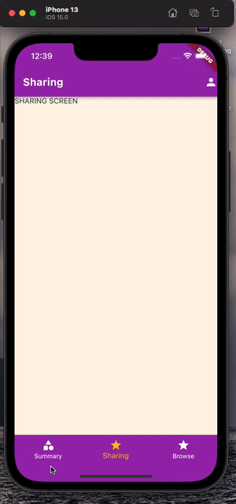

# Health App

The Health App is a mobile application that enables users to store details about their health to understand trends.

## Description

The goal of this application was to get familiar with Flutter - widgets, navigation and routing, and styling. There are three major screens (summary, sharing, and browsing) that allows users to review information about their daily activities. The Browse screen contains a wide list of categories such as body measurements, cycle tracking, and hearing.

## Getting Started

### Dependencies

* Please note the icon was added to the IOS file and not the android

## Version History

* 0.0
    * Initial scaffoling of the application
    * Added multiple screens to enable routing with bottom navigation bar
* 0.1
    * Created reusuable widgets and dummy data 
    * Added styling & interactions
    * Added third party libraries (table_calendar, faker) to improve application

## Future Improvements
- Add unit tests and end to end tests to ensure functionality and stability of application and prevent regressions
- Utilize open source APIs to serve data and remove dummy data
- Refactor application to have more reusable widgets
